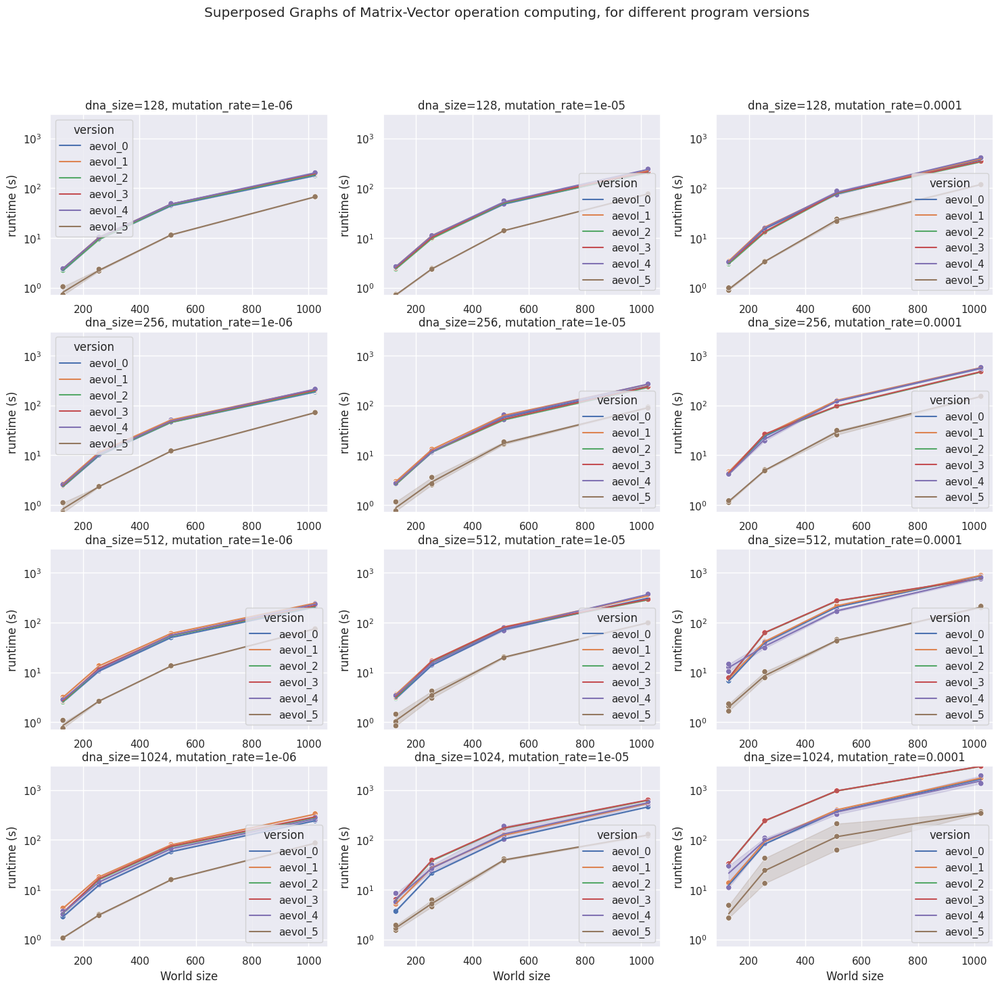

# Micro-Aevol : A micro-version of the Aevol simulator.

A reduced version (from a model and implementation point of view) of Aevol (in silico experimental evolution platform).

> WARN: DO NOT USE IT TO SIMULATE BIOLOGICAL RESULTS ! See [http://www.aevol.fr](http://www.aevol.fr) for that !

It must be used only to test HPC optimization of the code (parallel, vector, porting to new architecture...).

## Getting Started

These instructions will get you a copy of the project up and running on your local machine for development and testing purposes.

### Prerequisites

You will need a unix base system. Sorry for Windows users, maybe try with [Cygwin](http://www.cygwin.com/)

You will also need to install zlib (and its headers):

+ On Debian, Ubuntu, Mint, ... (apt): `zlib1g-dev`
+ On Arch (pacman): `zlib`
+ On Fedora (dnf, rpm): `zlib-devel`

To use cuda implementation, you will need to install the cuda-toolkit:

+ On all distributions: `cuda`

### Compilation

The compilation is straightforward

```
mkdir build
cd build
cmake ..
make
```

It will produced the executable `micro_aevol_cpu`.

If CUDA toolkit is available on your system, you can build the software with GPU support

```
cmake .. -DUSE_CUDA=on
make
```

It will produced the executable micro_aevol_gpu.

## Running a simulation

A help is given to explain the different parameters when using option `-H` or `--help`.

Basically, you must create a directory to store the simulation files (backup/checkpointing and stats files) and then run the simulation

```
mkdir simulation_example_1
cd simulation_example_1
PATH/TO/micro_aevol_cpu
```

You can also resume a simulation from a backup/checkpointing file (for example, resuming from the generation 1000):

```
cd simulation_example_1
PATH/TO/micro_aevol_cpu -r 1000
```

## Model and Implementation

These [slides](/presentation/slides.pdf) give a short presentation of the model and the purpose of this project can

## Authors

Initial work and supervision:

* **Jonathan Rouzaud-Cornabas**
* **Laurent Turpin**

For the authors of Aevol software, see [http://www.aevol.fr](http://www.aevol.fr)

Authors of current repository:

* **Florian (Onyr) Rascoussier**
* **Bastien Barbe**

## Our Optimizations

* `src/aevols/aevol_0`: Basic program, untouched.
* `src/aevols/aevol_1`: Replaced `std::vector<char> seq_;` from `Dna.h` by `boost::dynamic_bitset<> seq_;`
* `src/aevols/aevol_2`: Removed the individuals `boost::dynamic_bitset<> seq_;` and created a unique 1D dynamic bitset `std::unique_ptr<boost::dynamic_bitset<>> DNA_seqs;` inside `ExpManager.h`.
* `src/aevols/aevol_3`: Started to use `Kokkos` to parallelize the loops inside `ExpManager.cpp` `ExpManager::ExpManager`.
* `src/aevols/aevol_4`: Replaced `boost::dynamic_bitset<> DNA_seqs` by  `Kokkos::View<char*, Kokkos::DefaultHostExecutionSpace::memory_space> DNA_seqs`.
* `src/aevols/aevol_5`: Working on parallelization of `for` loops inside `ExpManager::run_a_step()` with `Kokkos`.
* `src/aevols/aevol_6`: **Unreleased:** Working on GPU with `Kokkos`. Still using CPU. We made 2 differents attemps of `aevol_6` without successfully succeded to run a part of the code on GPU using `Kokkos` as a wrapper for `Cuda`.

## License

This project is licensed under the GPLv2 License

## Results

The speed execution of 5 different versions of `aevol_x` have been measure of a 64-bit Ubuntu 22.04 LTS, with 32 GiB of RAM, AMD® Ryzen 7 3700x 8-core processor × 16.

The computations took several days. A system makes it possible to stop the computations and continue, so the computations were done over the course of 5 days, between Jan 23rd and Jan 27th 2023. The different parameters used are the following:

```python
experiment_params = {
    "dna_sizes": [128, 256, 512, 1024], # size of DNA
    "mutation_rates": [0.000001, 0.00001, 0.0001], # mutation rate
    "world_sizes": [128, 256, 512, 1024], # size of the world
}
```



The best program version is without doubt `aevol_5` which uses `Kokkos` on CPU only. More detailed interpretations inside `src/compilation.ipynb`.
